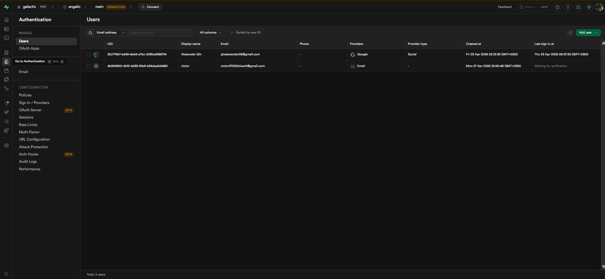

# Authentication System - Complete Implementation Guide

## Overview

This document provides a comprehensive guide to the Safe Hands Escrow authentication system, including all recent fixes and improvements.

## Recent Changes Summary

### Phase 1: Critical RLS Fix ✅

- **Issue**: `42501: new row violates row-level security policy for table "users"`
- **Solution**: Updated `app/actions/auth.js` to use `supabaseAdmin` for profile creation
- **Impact**: Signup now works correctly without RLS errors

### Phase 2: Auth Flow Completion ✅

- **Database Schema**: Added `buyer_seller` role and `email_verified_at` column
- **Signup Form**: Updated to support "Both Buyer & Seller" option
- **Login**: Added email verification requirement and "remember me" (1 week session)
- **Viewport**: Fixed Next.js metadata warnings

### Phase 3: Security Hardening ✅

- **Rate Limiting**: Implemented production-only rate limiting
  - Login: 5 attempts per 15 minutes per IP
  - Signup: 3 attempts per hour per IP
  - Email operations: 3 per 5 minutes per email
- **Updated APIs**: `forgot-password` and `resend-verification` now use centralized rate limiter

## Database Schema

### Users Table

```sql
CREATE TABLE users (
  id UUID PRIMARY KEY DEFAULT uuid_generate_v4(),
  email VARCHAR(255) UNIQUE NOT NULL,
  phone_number VARCHAR(20) UNIQUE,
  full_name VARCHAR(255) NOT NULL,
  role VARCHAR(50) NOT NULL DEFAULT 'buyer' CHECK (role IN ('buyer', 'seller', 'admin', 'buyer_seller')),
  kyc_status VARCHAR(50) NOT NULL DEFAULT 'pending',
  kyc_data JSONB,
  profile_picture_url TEXT,
  bio TEXT,
  is_active BOOLEAN DEFAULT true,
  account_balance DECIMAL(15, 2) DEFAULT 0.00,
  total_transactions_completed INT DEFAULT 0,
  avg_rating DECIMAL(3, 2),
  email_verified_at TIMESTAMP WITH TIME ZONE,
  created_at TIMESTAMP WITH TIME ZONE DEFAULT CURRENT_TIMESTAMP,
  updated_at TIMESTAMP WITH TIME ZONE DEFAULT CURRENT_TIMESTAMP,
  last_login TIMESTAMP WITH TIME ZONE
);
```

### Key Features:

- `buyer_seller` role for users who are both buyers and sellers
- `email_verified_at` to track email verification status
- Proper indexes for performance

## Authentication Flow

### 1. Signup Flow

```
User fills signup form → Validate → Create Auth user → Create profile (supabaseAdmin) → Send verification email → Show verification modal
```

**Files involved:**

- `components/auth/SignUpForm.js` - Frontend form
- `app/actions/auth.js` - Server action
- `lib/tokenService.js` - Token generation
- `lib/emailService.js` - Email sending

### 2. Email Verification Flow

```
User clicks email link → /auth/verify-email page → POST /api/auth/verify-email → Mark email as verified → Redirect to login
```

**Files involved:**

- `app/auth/verify-email/page.js` - Verification page
- `app/api/auth/verify-email/route.js` - API endpoint
- `lib/tokenService.js` - Token verification

### 3. Login Flow

```
User enters credentials → Check rate limit → Authenticate → Verify email confirmed → Get user role → Redirect to appropriate dashboard
```

**Files involved:**

- `components/auth/LoginForm.js` - Login form
- `lib/rateLimiter.js` - Rate limiting (production only)

### 4. Password Reset Flow

```
User requests reset → /api/auth/forgot-password → Send reset email → User clicks link → /auth/reset-password → Validate token → Update password
```

**Files involved:**

- `app/auth/forgot-password/page.js` - Request page
- `app/api/auth/forgot-password/route.js` - Request API
- `app/auth/reset-password/page.js` - Reset page
- `app/api/auth/reset-password/route.js` - Reset API

## Security Features

### Rate Limiting (Production Only)

- Configured in `lib/rateLimiter.js`
- Only active when `NODE_ENV=production`
- In-memory storage (consider Redis for production)

### Email Verification Required

- Users must verify email before logging in
- Token expires in 24 hours
- Can resend verification email

### Password Requirements

- Minimum 8 characters
- At least one uppercase letter
- At least one lowercase letter
- At least one number
- At least one special character

### Session Management

- "Remember me" option extends session to 1 week
- Default session duration based on Supabase settings

## API Endpoints

### Authentication

| Endpoint                        | Method | Description                   | Rate Limit |
| ------------------------------- | ------ | ----------------------------- | ---------- |
| `/api/auth/signup`              | POST   | Server action, not direct API | 3/hour     |
| `/api/auth/verify-email`        | POST   | Verify email token            | -          |
| `/api/auth/resend-verification` | POST   | Resend verification email     | 3/5min     |
| `/api/auth/forgot-password`     | POST   | Request password reset        | 3/5min     |
| `/api/auth/reset-password`      | POST   | Reset password                | -          |
| `/api/auth/reset-password`      | GET    | Validate reset token          | -          |
| `/api/auth/logout`              | POST   | Logout user                   | -          |
| `/api/auth/user`                | GET    | Get current user              | -          |

## Environment Variables

Required environment variables:

```env
# Supabase
NEXT_PUBLIC_SUPABASE_URL=your_supabase_url
NEXT_PUBLIC_SUPABASE_ANON_KEY=your_anon_key
SUPABASE_SERVICE_ROLE_KEY=your_service_role_key

# Email
GMAIL_APP_EMAIL=your_gmail
GMAIL_APP_PASSWORD=your_gmail_app_password

# Application
NEXT_PUBLIC_APP_URL=http://localhost:3000
NODE_ENV=development
```

## Testing Checklist

### Signup

- [ ] Can create account with valid data
- [ ] Cannot signup with existing email
- [ ] Password validation works
- [ ] Phone number validation works (Kenyan format)
- [ ] Verification email is sent
- [ ] Profile is created in database

### Email Verification

- [ ] Can verify email with valid token
- [ ] Invalid token shows error
- [ ] Expired token shows error
- [ ] Can resend verification email
- [ ] Already verified email shows appropriate message

### Login

- [ ] Can login with valid credentials
- [ ] Cannot login without verified email
- [ ] Invalid credentials show error
- [ ] "Remember me" extends session
- [ ] Redirects to correct dashboard based on role

### Password Reset

- [ ] Can request password reset
- [ ] Reset email is sent
- [ ] Can reset password with valid token
- [ ] Invalid token shows error
- [ ] Expired token shows error
- [ ] Password requirements enforced

## Migration Instructions

### Step 1: Update Database Schema

Run the migration script to add the new columns and update the role constraint:

```sql
-- Add email_verified_at column if not exists
ALTER TABLE users ADD COLUMN IF NOT EXISTS email_verified_at TIMESTAMP WITH TIME ZONE;

-- Update role constraint to include buyer_seller
-- Note: This requires dropping and recreating the constraint
ALTER TABLE users DROP CONSTRAINT IF EXISTS users_role_check;
ALTER TABLE users ADD CONSTRAINT users_role_check
  CHECK (role IN ('buyer', 'seller', 'admin', 'buyer_seller'));
```

### Step 2: Update Environment Variables

Ensure all required environment variables are set in `.env.local`:

```env
NODE_ENV=development  # Change to 'production' in production
```

### Step 3: Restart Development Server

```bash
# Stop the server
Ctrl+C

# Clear Next.js cache


# Restart
npm run dev
# or
pnpm dev
```

## Troubleshooting

### RLS Error (42501)

**Cause**: Using regular supabase client instead of supabaseAdmin for profile creation
**Solution**: Ensure `app/actions/auth.js` imports and uses `supabaseAdmin`

### Email Not Sending

**Cause**: Gmail credentials not configured
**Solution**: Set `GMAIL_APP_EMAIL` and `GMAIL_APP_PASSWORD` in `.env.local`

### Rate Limiting Not Working

**Cause**: Rate limiting only works in production
**Solution**: Set `NODE_ENV=production` to test, or check `lib/rateLimiter.js`

### Viewport Warnings

**Cause**: viewport in metadata export instead of separate export
**Solution**: Move viewport to separate export in `app/layout.js`

## Next Steps

1. **Testing**: Run through the complete testing checklist
2. **Production Setup**: Configure Redis for rate limiting in production
3. **Monitoring**: Set up logging and monitoring for auth events
4. **Security Audit**: Consider additional security measures like 2FA

## Support

For issues or questions:

1. Check this documentation
2. Review the code comments
3. Check the console logs (prefixed with `[v0]`)
4. Review Supabase dashboard for database issues
